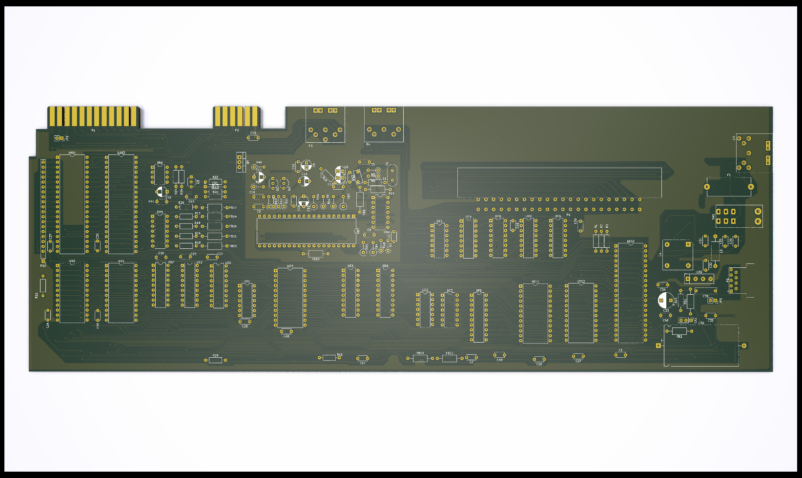

# Commodore VIC-20 Schematic and PCB for assembly 250403

This repository contains KiCad schematics and "rough" PCB layout for the
cost reduced VIC-20, assembly #250403.

Originally hard forked from <https://github.com/StormTrooper/Commodore-Vic-20>
(this does not appear to be maintained).

The schematic for the Commodore VIC-20 (251027-01 Rev D) was taken from the
schematics on zimmers.net with extra detail from the "Vic-20 friendly computer
technical manual" and converted into KiCad (Version 8).

Additionally includes some KiCad footprints and symbols for the custom components.

## State

The schematics are complete and 95% of the PCB layout is done but it is not
complete. The power supply section of the board is mostly unfinished, and
accurate footprints for the large inductor, power switch and bridge rectifier are
needed.

## Notes

This is a WIP as the documentation and detail on the actual PCB are far from
clear and require some deciphering.

The power management section of the board in particular is unfinished.

The PCB design, while true to the original, is not intended for fabrication.
Instead the board has been reconstructed for the purpose of diagnosing faults
on original Commodore boards. The overall board dimensions are accurate but
the positioning of the different ports are approximations based on the rather
distorted board scans in the technical manual.

## KiCad thumbnail of schematic and pcb

